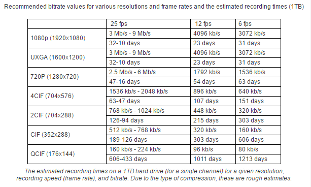

# AVRecorder

Audio and Video Recorder project created by Kido. 

To be continued..

#Usage

###AndroidManifest.xml

```xml
  <uses-permission android:name="android.permission.INTERNET"/>
  <uses-permission android:name="android.permission.WRITE_EXTERNAL_STORAGE"/>

   <!-- for Audio Recorder -->
  <uses-permission android:name="android.permission.RECORD_AUDIO"/>

  <!-- for Video Recorder -->
  <uses-permission android:name="android.permission.RECORD_VIDEO" />
  <uses-permission android:name="android.permission.CAMERA"/>
  <uses-permission android:name="android.permission.WAKE_LOCK"/>
  <uses-permission android:name="android.permission.STORAGE" />

  <permission
      android:name="android.permission.FLASHLIGHT"
      android:permissionGroup="android.permission-group.HARDWARE_CONTROLS"
      android:protectionLevel="normal"/>

  <uses-feature android:name="android.hardware.camera"/>
  <uses-feature android:name="android.hardware.camera.autofocus"/>

  <uses-feature
      android:name="android.hardware.camera.front"
      android:required="false"/>

   <!-- for Video Recorder -->
   <activity
     android:name="com.kido.videorecorder.manager.RecordVideoActivity"
     android:screenOrientation="portrait"
     android:theme="@android:style/Theme.NoTitleBar.Fullscreen"/>

```

###Java Code

###### VoiceRecorder (Mp3)
```java
// init recorder
// by default, minDurationSecond = 1, maxDurationSecond = Integer.MAX_VALUE / 2 
VoiceRecorder voiceRecorder = new VoiceRecorder();
// or
VoiceRecorder voiceRecorder = new VoiceRecorder(int minDurationSecond, int maxDurationSecond);

String savePath = Consts.MEDIA_PATH + "/" + System.currentTimeMillis() + ".mp3";

// start recorder
voiceRecorder.startRecording(savePath, new VoiceRecorder.OnRecordListener() {
  @Override
  public void onRecord(int curDurationSecond) {
  }

  @Override
  public void onFail(int failCode, String failMessage) {
  }

  @Override
  public void onFinish(int totalDurationSecond, String savePath) {
  }
});

// stop recorder
voiceRecorder.stopRecording();

// failure code below in VoiceRecorder
public static final int FAILURE_CODE_PERMISSION_DENY = -100;
public static final int FAILURE_CODE_FILE_CREATE_ERROR = -101;
public static final int FAILURE_CODE_DURATION_TOO_SHORT = -102;
public static final int FAILURE_CODE_WRITE_ERROR = -103;
public static final int FAILURE_CODE_UNDER_RECORDING = -104;

public static final int FAILURE_CODE_EXEPTION = -500;
```
###### VideoRecorder (Mp4)
```java
// this will start the recorder activity
VideoRecorder.getInstance().startRecording(context, new VideoRecorder.OnRecordListener() {
  @Override
  public void onFail() { // reserved todos: callback with more failure codes.
  }

  @Override
  public void onFinish(String savePath) {
  }
});

// or start the RecordActivity directly by using startActivityForResult(..)

  Intent intent = new Intent(this, RecordVideoActivity.class);
  startActivityForResult(intent, REQUEST_CODE_VIDEO);

  private static final int REQUEST_CODE_VIDEO = 52001;

  @Override
  protected void onActivityResult(int requestCode, int resultCode, Intent data) {
    super.onActivityResult(requestCode, resultCode, data);
    if (requestCode == REQUEST_CODE_VIDEO) {
      if (resultCode == RESULT_OK) {
        // success
        String savePath = data.getStringExtra(RecordVideoActivity.KEY_PATH);
      } else {
        // failure
      }
    }
  }

// failure code below in VideoRecorder
public static final int FAILURE_CODE_INIT_ERROR = -10;

public static final int FAILURE_CODE_PERMISSION_DENY = -100;
public static final int FAILURE_CODE_FILE_CREATE_ERROR = -101;
public static final int FAILURE_CODE_DURATION_TOO_SHORT = -102;
public static final int FAILURE_CODE_WRITE_ERROR = -103;
public static final int FAILURE_CODE_UNDER_RECORDING = -104;
public static final int FAILURE_CODE_SDCARD_ERROR = -105;
public static final int FAILURE_CODE_ON_PAUSE = -106;
public static final int FAILURE_CODE_ON_BACK = -107;
public static final int FAILURE_CODE_CAMERA_FAIL = -108;

public static final int FAILURE_CODE_EXEPTION = -500;
```
#About Video


#Todos

1. 音频和视频开始录制之前涉及的权限检测、存储检测等以及提示。

2. 视频录制，保证清晰度的同时尽可能压缩容量。

3. 视频录制界面的UI和交互的优化。

4. 视频录制时涉及失败或者取消的情况，在Listener中的onFail尽可能详细的回调，类似音频回调的FailureCode。

5. 自定义视频尺寸（长*宽）、视频最小/最大时长、保存路径等。

6. 资源的分配和释放，应该考虑更加周全一点。

7. 多机型测试，估计会存在一些bug。 

